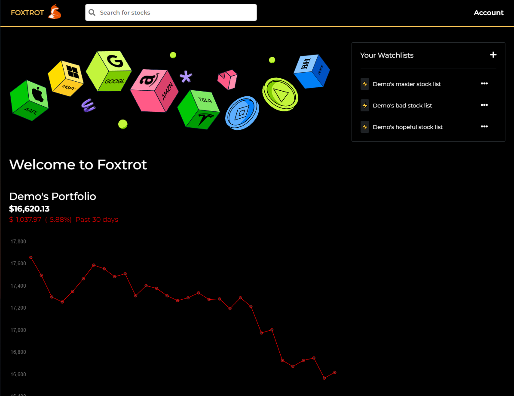

# FOXTROT (Flask React Project)

## About

Hello, thanks for checking out our project! This is our second fullstack web application created as App Academy students. The project is a clone of Robinhood and uses Python, Flask and SQLAlchemy for the backend structure. The front end was created using JavaScript, React, Redux and vanilla CSS to style the site.

Currently the app has functionality to authenticate users, add funds to a user account, buy/sell stock, view stock details, search for a stock, view/create/delete/edit a stock watchlist, view a user portfolio, and view a user's transaction history. The stock details page shows a graph of the stock's value over time; the user portfolio page shows a graph of the value of the user's stocks over time.


## Frontend screenshots
The search bar dynamically renders results matching the user input, giving suggestions for a stock based on its ticker symbol or name.


The portfolio page shows a graph of the value of the user's stocks over time, and any watchlists they have created.



The stock details page shows a graph of the stock's value over time, and renders a form where the user can buy and sell stock.


The watchlist shows a list of stocks the user has added to the list. The user can add or delete stocks to a list, create new lists, and delete existing lists.


This site is currently live here: https://foxtrot.onrender.com/. You can also clone the repo and run locally by following the instructions below.

## Getting started
1. Clone this repository (only this branch)

2. Install dependencies

      ```bash
      pipenv install -r requirements.txt
      ```

3. Create a **.env** file based on the example with proper settings for your
   development environment

4. Make sure the SQLite3 database connection URL is in the **.env** file

5. This starter organizes all tables inside the `flask_schema` schema, defined
   by the `SCHEMA` environment variable.  Replace the value for
   `SCHEMA` with a unique name, **making sure you use the snake_case
   convention**.

6. Get into your pipenv, migrate your database, seed your database, and run your Flask app

   ```bash
   pipenv shell
   ```

   ```bash
   flask db upgrade
   ```

   ```bash
   flask seed all
   ```

   ```bash
   flask run
   ```

7. To run the React App in development, checkout the [README](./react-app/README.md) inside the `react-app` directory.

8. Navigate to the react-app directory and install dependencies then start the app

   ```bash
   npm install
   ```

   ```bash
   npm start
   ```
