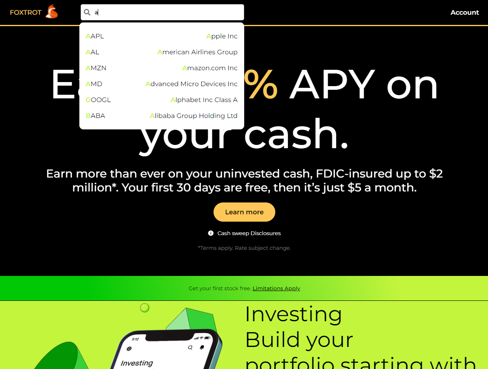

# FOXTROT (Flask React Project)

## About

Hello, thanks for checking out our project! This is our second fullstack web application created as App Academy students. The project is a clone of Robinhood and uses Python, Flask and SQLAlchemy for the backend structure. The front end was created using JavaScript, React, Redux and vanilla CSS to style the site.

Currently the app has functionality to authenticate users, add funds to a user account, buy/sell stock, view stock details, search for a stock, view/create/delete/edit a stock watchlist and view logged in user's transaction history.

This site is currently live here: https://foxtrot.onrender.com/. You can also clone the repo and run locally by following the instructions below.

## Frontend screenshots




## Getting started
1. Clone this repository (only this branch)

2. Install dependencies

      ```bash
      pipenv install -r requirements.txt
      ```

3. Create a **.env** file based on the example with proper settings for your
   development environment

4. Make sure the SQLite3 database connection URL is in the **.env** file

5. This starter organizes all tables inside the `flask_schema` schema, defined
   by the `SCHEMA` environment variable.  Replace the value for
   `SCHEMA` with a unique name, **making sure you use the snake_case
   convention**.

6. Get into your pipenv, migrate your database, seed your database, and run your Flask app

   ```bash
   pipenv shell
   ```

   ```bash
   flask db upgrade
   ```

   ```bash
   flask seed all
   ```

   ```bash
   flask run
   ```

7. To run the React App in development, checkout the [README](./react-app/README.md) inside the `react-app` directory.

8. Navigate to the react-app directory and install dependencies then start the app

   ```bash
   npm install
   ```

   ```bash
   npm start
   ```

## Deployment through Render.com

First, refer to your Render.com deployment articles for more detailed
instructions about getting started with [Render.com], creating a production
database, and deployment debugging tips.

From the [Dashboard], click on the "New +" button in the navigation bar, and
click on "Web Service" to create the application that will be deployed.

Look for the name of the application you want to deploy, and click the "Connect"
button to the right of the name.

Now, fill out the form to configure the build and start commands, as well as add
the environment variables to properly deploy the application.

### Configure the Start and Build Commands

Start by giving your application a name.

Leave the root directory field blank. By default, Render will run commands from
the root directory.

Make sure the Environment field is set set to "Python 3", the Region is set to
the location closest to you, and the Branch is set to "main".

Next, add your Build command. This is a script that should include everything
that needs to happen _before_ starting the server.

For your Flask project, enter the following command into the Build field, all in
one line:

```shell
# build command - enter all in one line
npm install --prefix react-app &&
npm run build --prefix react-app &&
pip install -r requirements.txt &&
pip install psycopg2 &&
flask db upgrade &&
flask seed all
```

This script will install dependencies for the frontend, and run the build
command in the __package.json__ file for the frontend, which builds the React
application. Then, it will install the dependencies needed for the Python
backend, and run the migration and seed files.

Now, add your start command in the Start field:

```shell
# start script
gunicorn app:app
```
